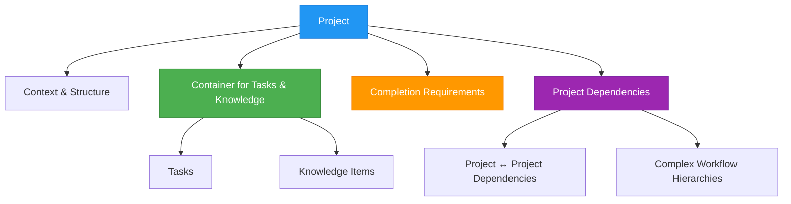
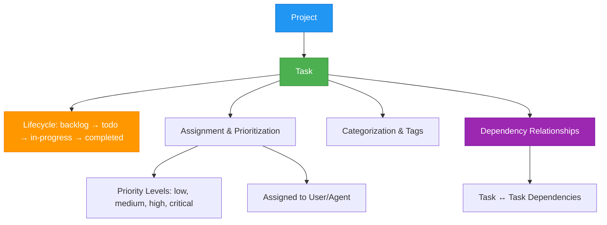
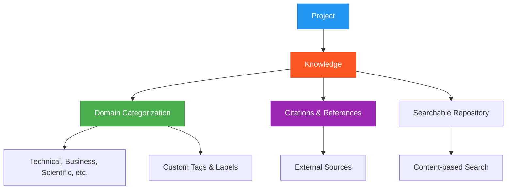

# ATLAS: Task Management System

[](https://www.typescriptlang.org/)
[](https://modelcontextprotocol.io/)
[](https://github.com/cyanheads/atlas-mcp-server/releases)
[](https://opensource.org/licenses/Apache-2.0)
[]()
[](https://github.com/cyanheads/atlas-mcp-server)

ATLAS (Adaptive Task & Logic Automation System) is a task management system for LLM Agents.

Built on a three-tier architecture:

```
                  +------------------------------------------+
                  |                PROJECT                   |
                  |------------------------------------------|
                  | id: string                               |
                  | name: string                             |
                  | description: string                      |
                  | status: string                           |
                  | urls: Array<{title: string, url: string}>|
                  | completionRequirements: string           |
                  | outputFormat: string                     |
                  | taskType: string                         |
                  | createdAt: string                        |
                  | updatedAt: string                        |
                  +----------------+-------------------------+
                              |                    |
                              |                    |
                              v                    v
+----------------------------------+ +----------------------------------+
|             TASK                 | |                KNOWLEDGE         |
|----------------------------------| |----------------------------------|
| id: string                       | | id: string                       |
| projectId: string                | | projectId: string                |
| title: string                    | | text: string                     |
| description: string              | | tags: string                     |
| priority: string                 | | domain: string                   |
| status: string                   | | citations: string[]              |
| assignedTo: string               | | createdAt: string                |
| urls: Array<{}>                  | | updatedAt: string                |
| tags: string[]                   | |                                  |
| completionRequirements: string   | |                                  |
| outputFormat: string             | |                                  |
| taskType: string                 | |                                  |
| createdAt: string                | |                                  |
| updatedAt: string                | |                                  |
+----------------------------------+ +----------------------------------+
```

Implemented as a Model Context Protocol (MCP) server, ATLAS allows LLM agents to interact with project management database, enabling managing projects, tasks, and knowledge items.

> **Important Version Note**: [Version 1.5.4](https://github.com/cyanheads/atlas-mcp-server/releases/tag/v1.5.4) is the last version that uses SQLite as the database. Version 2.0 and onwards has been completely rewritten to use Neo4j, which requires either:
>
> - Self-hosting using Docker (docker-compose included in repository)
> - Using Neo4j AuraDB cloud service: https://neo4j.com/product/auradb/
>
> Version 2.5.0 introduces a new 3-node system (Projects, Tasks, Knowledge) that replaces the previous structure.

## Table of Contents

- [Overview](#overview)
- [Features](#features)
- [Installation](#installation)
- [Configuration](#configuration)
- [Project Structure](#project-structure)
- [Tools](#tools)
- [Resources](#resources)
- [Database Backup and Restore](#database-backup-and-restore)
- [Contributing](#contributing)
- [License](#license)

## Overview

ATLAS implements the Model Context Protocol (MCP), enabling standardized communication between LLMs and external systems through:

- **Clients**: Claude Desktop, IDEs, and other MCP-compatible clients
- **Servers**: Tools and resources for project, task, and knowledge management
- **LLM Agents**: AI models that leverage the server's management capabilities

### Core Components

**Projects** are the highest-level organizational units in the Atlas Platform that represent complete initiatives with defined goals, timelines, and deliverables.



**Tasks** are discrete units of work that contribute to project completion, representing specific actions, assignments, or deliverables.



**Knowledge** represents information assets associated with projects, including research findings, documentation, references, or any valuable information.



### System Integration

The Atlas Platform integrates these components into a cohesive system:

- **Project-Task Relationship**: Projects contain tasks that represent actionable steps needed to achieve project goals. Tasks inherit context from their parent project while providing granular tracking of individual work items.
- **Knowledge Integration**: Both projects and tasks can be enriched with knowledge items, providing team members with necessary information and context.
- **Dependency Management**: Both projects and tasks support dependency relationships, allowing for complex workflows with prerequisites and sequential execution requirements.
- **Unified Search**: The platform provides cross-entity search capabilities, allowing users to find relevant projects, tasks, or knowledge based on various criteria.

## Features

### Project Management

- **Comprehensive Tracking:** Manage project metadata, statuses, and rich content (notes, links, etc.) with built-in support for bulk operations.
- **Dependency & Relationship Handling:** Automatically validate and track inter-project dependencies.

### Task Management

- **Task Lifecycle Management:** Create, track, and update tasks through their entire lifecycle.
- **Prioritization & Categorization:** Assign priority levels and categorize tasks with tags for better organization.
- **Dependency Tracking:** Establish task dependencies to create structured workflows.

### Knowledge Management

- **Structured Knowledge Repository:** Maintain a searchable repository of project-related information.
- **Domain Categorization:** Organize knowledge by domain and tags for easy retrieval.
- **Citation Support:** Track sources and references for knowledge items.

### Graph Database Integration

- **Native Relationship Management:** Leverage Neo4j's ACID-compliant transactions and optimized queries for robust data integrity.
- **Advanced Search & Scalability:** Perform property-based searches with fuzzy matching and wildcards while maintaining high performance.

### Unified Search

- **Cross-Entity Search:** Find relevant projects, tasks, or knowledge based on content, metadata, or relationships.
- **Flexible Query Options:** Support for case-insensitive, fuzzy, and advanced filtering options.

## Installation

1. Clone the repository:

```bash
git clone https://github.com/cyanheads/atlas-mcp-server.git
cd atlas-mcp-server
```

2. Install dependencies:

```bash
npm install
```

3. Configure Neo4j:

```bash
# Start Neo4j using Docker
docker-compose up -d
```

4. Build the project:

```bash
npm run build
```

## Configuration

### Environment Variables

Create a `.env` file based on `.env.example`:

```bash
# Neo4j Configuration
NEO4J_URI=bolt://localhost:7687
NEO4J_USER=neo4j
NEO4J_PASSWORD=password2

# Application Configuration
LOG_LEVEL=info # debug, info, warn, error
NODE_ENV=development # development, production
```

### MCP Client Settings

Add to your MCP client settings:

```json
{
  "mcpServers": {
    "atlas": {
      "command": "node",
      "args": ["/path/to/atlas-mcp-server/dist/index.js"],
      "env": {
        "NEO4J_URI": "bolt://localhost:7687",
        "NEO4J_USER": "neo4j",
        "NEO4J_PASSWORD": "password2",
        "LOG_LEVEL": "info",
        "NODE_ENV": "production"
      }
    }
  }
}
```

## Project Structure

The codebase follows a modular structure:

```
src/
├── config/          # Configuration management (index.ts)
├── index.ts         # Main server entry point
├── mcp/             # MCP server implementation (server.ts)
│   ├── resources/   # MCP resource handlers (index.ts, types.ts, knowledge/, projects/, tasks/)
│   └── tools/       # MCP tool handlers (individual tool directories)
├── services/        # Core application services
│   └── neo4j/       # Neo4j database services (index.ts, driver.ts, backupRestoreService.ts, etc.)
├── types/           # Shared TypeScript type definitions (errors.ts, mcp.ts, tool.ts)
└── utils/           # Utility functions (logger.ts, errorHandler.ts, idGenerator.ts, etc.)
```

## Tools

ATLAS provides a comprehensive suite of tools for project, task, and knowledge management:

### Project Operations

| Tool                   | Description                                                                                                                                                                                                                                                                                    |
| ---------------------- | ---------------------------------------------------------------------------------------------------------------------------------------------------------------------------------------------------------------------------------------------------------------------------------------------- |
| `atlas_project_create` | Creates and initializes new projects within the platform ecosystem. Supports both single and bulk creation modes with options for project metadata including name, description, status, URLs, completion requirements, dependencies, output format, and task type.                             |
| `atlas_project_list`   | Retrieves and filters project entities based on specified criteria. Offers modes for listing all projects or getting details of a specific project, with options for pagination, including related knowledge and tasks, and filtering by task type or status (including "in-progress" status). |
| `atlas_project_update` | Modifies attributes of existing project entities within the system. Supports updating individual projects or applying bulk updates to multiple projects simultaneously, with partial updates that modify only specified fields.                                                                |
| `atlas_project_delete` | Removes project entities and associated resources from the system. Supports deletion of single projects or batch removal of multiple projects in one operation.                                                                                                                                |

### Task Operations

| Tool                | Description                                                                                                                                                                                                                                                                          |
| ------------------- | ------------------------------------------------------------------------------------------------------------------------------------------------------------------------------------------------------------------------------------------------------------------------------------ |
| `atlas_task_create` | Creates a new task or multiple tasks in the system. Tasks always belong to a parent project and include details such as title, description, priority, status (including "in-progress"), assignment, URLs, tags, completion requirements, dependencies, output format, and task type. |
| `atlas_task_update` | Updates existing task(s) in the system. Supports modifying individual tasks or applying bulk updates to multiple tasks simultaneously, with partial updates that modify only specified fields.                                                                                       |
| `atlas_task_delete` | Deletes existing task(s) from the system. Supports deletion of single tasks or batch removal of multiple tasks in one operation.                                                                                                                                                     |
| `atlas_task_list`   | Lists tasks according to specified filters. Required to specify a project ID, with options to filter by status (including "in-progress"), assignment, priority, tags, and task type. Includes sorting and pagination options.                                                        |

### Knowledge Operations

| Tool                     | Description                                                                                                                                                                                                                      |
| ------------------------ | -------------------------------------------------------------------------------------------------------------------------------------------------------------------------------------------------------------------------------- |
| `atlas_knowledge_add`    | Adds a new knowledge item or multiple items to the system. Knowledge items always belong to a parent project and include text content, tags for organization, domain categorization, and optional citations to external sources. |
| `atlas_knowledge_delete` | Deletes existing knowledge item(s) from the system. Supports deletion of single items or batch removal of multiple knowledge items in one operation.                                                                             |
| `atlas_knowledge_list`   | Lists knowledge items according to specified filters. Required to specify a project ID, with options to filter by tags, domain, and text content. Includes pagination options.                                                   |

### Search Operations

| Tool                   | Description                                                                                                                                                                                                                                                                  |
| ---------------------- | ---------------------------------------------------------------------------------------------------------------------------------------------------------------------------------------------------------------------------------------------------------------------------- |
| `atlas_unified_search` | Performs a unified search across all entity types (projects, tasks, and knowledge). Supports searching by specific properties with options for case-insensitive and fuzzy matching. Results can be filtered by entity type and task classification, with pagination support. |

### Database Operations

| Tool                   | Description                                                                                                                                                       |
| ---------------------- | ----------------------------------------------------------------------------------------------------------------------------------------------------------------- |
| `atlas_database_clean` | Completely resets the database - permanently removes all data. Requires explicit acknowledgment to prevent accidental data loss. This operation cannot be undone. |

## Resources

ATLAS exposes system resources through standard MCP endpoints:

### Direct Resources

| Resource            | Description                                                                        |
| ------------------- | ---------------------------------------------------------------------------------- |
| `atlas://projects`  | List of all projects in the Atlas platform with pagination support.                |
| `atlas://tasks`     | List of all tasks in the Atlas platform with pagination and filtering support.     |
| `atlas://knowledge` | List of all knowledge in the Atlas platform with pagination and filtering support. |

### Resource Templates

| Resource Template                        | Description                                                    |
| ---------------------------------------- | -------------------------------------------------------------- |
| `atlas://projects/{projectId}`           | Retrieves a single project by its unique identifier.           |
| `atlas://tasks/{taskId}`                 | Retrieves a single task by its unique identifier.              |
| `atlas://projects/{projectId}/tasks`     | Retrieves all tasks belonging to a specific project.           |
| `atlas://knowledge/{knowledgeId}`        | Retrieves a single knowledge item by its unique identifier.    |
| `atlas://projects/{projectId}/knowledge` | Retrieves all knowledge items belonging to a specific project. |

## Database Backup and Restore

ATLAS provides functionality to back up and restore the Neo4j database content. The core logic resides in `src/services/neo4j/backupRestoreService.ts`.

### Automatic Backups (Note)

**Important:** The automatic backup functionality is currently not working. Please use the manual backup process described below until this feature is fully implemented.

The `src/services/neo4j/driver.ts` includes a `triggerBackgroundBackup` function that is intended to call `exportDatabase` after every write operation, but this feature is still under development. For now, rely on regular manual backups to protect your data.

### Backup Process

- **Mechanism**: The backup process exports all `Project`, `Task`, and `Knowledge` nodes, along with their relationships, into separate JSON files.
- **Output**: Each backup creates a timestamped directory (e.g., `atlas-backup-YYYYMMDDHHMMSS`) within the configured backup path (default: `./atlas-backups/`). This directory contains `projects.json`, `tasks.json`, `knowledge.json`, and `relationships.json`.
- **Manual Backup**: You can trigger a manual backup using the provided script:
  ```bash
  npm run db:backup
  ```
  This command executes `scripts/db-backup.ts`, which calls the `exportDatabase` function.

### Restore Process

- **Mechanism**: The restore process first completely clears the existing Neo4j database. Then, it imports nodes and relationships from the JSON files located in the specified backup directory.
- **Warning**: Restoring from a backup is a destructive operation. **It will overwrite all current data in your Neo4j database.**
- **Manual Restore**: To restore the database from a backup directory, use the import script:
  ```bash
  npm run db:import <path_to_backup_directory>
  ```
  Replace `<path_to_backup_directory>` with the actual path to the backup folder (e.g., `./atlas-backups/atlas-backup-20250326120000`). This command executes `scripts/db-import.ts`, which calls the `importDatabase` function.
- **Relationship Handling**: The import process attempts to recreate relationships based on the `id` properties stored within the nodes during export. Ensure your nodes have consistent `id` properties for relationships to be restored correctly.

## Contributing

1. Fork the repository
2. Create a feature branch
3. Commit your changes with a descriptive message
4. Push to the branch
5. Create a Pull Request

For bugs and feature requests, please create an issue.

## License

Apache License 2.0

---

<div align="center">
Built with the Model Context Protocol
</div>
