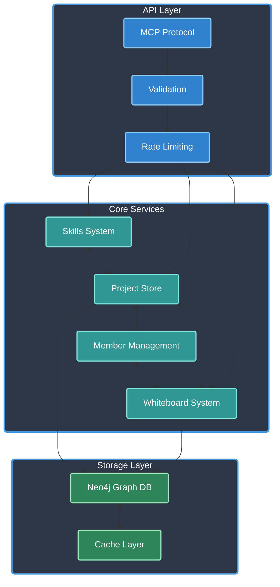

# ATLAS MCP Server

[](https://www.typescriptlang.org/)
[](https://modelcontextprotocol.io/)
[]()
[](https://opensource.org/licenses/Apache-2.0)
[]()
[](https://github.com/cyanheads/atlas-mcp-server)

ATLAS (Adaptive Task & Logic Automation System) is a Model Context Protocol server designed for LLMs to manage complex projects. Built with TypeScript and featuring Neo4j graph database integration, efficient project management, and collaborative features, ATLAS provides LLM Agents project management capabilities through a clean, flexible tool interface.

> **Important Version Note**: [Version 1.5.4](https://github.com/cyanheads/atlas-mcp-server/releases/tag/v1.5.4) is the last version that uses SQLite as the database. Version 2.0 and onwards has been completely rewritten to use Neo4j, which requires either:
> - Self-hosting using Docker (docker-compose included in repository)
> - Using Neo4j AuraDB cloud service: https://neo4j.com/product/auradb/

## Table of Contents

- [Overview](#overview)
  - [Architecture & Components](#architecture--components)
- [Features](#features)
  - [Project Management](#project-management)
  - [Collaboration](#collaboration)
  - [Whiteboard System](#whiteboard-system)
  - [Graph Database Integration](#graph-database-integration)
  - [ATLAS Skills](#atlas-skills)
- [Installation](#installation)
- [Configuration](#configuration)
- [Project Structure](#project-structure)
- [Tools](#tools)
  - [Project Operations](#project-operations)
  - [Member Management](#member-management)
  - [Dependency Management](#dependency-management)
  - [Whiteboard Operations](#whiteboard-operations)
  - [Database Operations](#database-operations)
  - [Database Backup and Restore](#database-backup-and-restore)
  - [ATLAS Skills](#atlas-skills)
- [Resources](#resources)
  - [Project Resources](#project-resources)
- [Database Backup and Restore](#database-backup-and-restore)
- [Contributing](#contributing)
- [License](#license)

## Overview

ATLAS implements the Model Context Protocol (MCP), enabling standardized communication between LLMs and external systems through:

- **Clients**: Claude Desktop, IDEs, and other MCP-compatible clients
- **Servers**: Tools and resources for project management and collaboration
- **LLM Agents**: AI models that leverage the server's project management capabilities

Key capabilities:

- **Project Management**: Comprehensive project lifecycle management with metadata and status tracking
- **Collaboration Tools**: Member management, dependencies, and resource linking
- **Whiteboard System**: Real-time collaborative whiteboards with version history
- **Graph Database**: Neo4j-powered relationship management and querying
- **ATLAS Skills**: Modular skill system for knowledge and best practices
- **Performance Focus**: Optimized caching, batch operations, and health monitoring
- **Graceful Shutdown**: Robust error handling and graceful shutdown mechanisms

### Architecture & Components

Core system architecture:

<details>
<summary>Click to expand Mermaid diagram</summary>


</details>

Core Components:

- **Storage Layer**: Neo4j graph database with caching layer
- **Project Layer**: Project management, relationships, and dependency tracking
- **Member System**: Role-based access control and collaboration
- **Skills System**: Modular knowledge and best practices implementation
- **Whiteboard Engine**: Real-time collaboration and version control
- **Error Handling**: Comprehensive error handling and logging system

## Features

### Project Management
- **Comprehensive Tracking:** Manage project metadata, statuses, and rich content (notes, links, etc.) with built-in support for bulk operations.
- **Dependency & Relationship Handling:** Automatically validate and track inter-project dependencies.

### Collaboration
- **Member & Role Management:** Enable team collaboration with role-based permissions (owner, admin, member, viewer).
- **Resource Sharing & Activity Tracking:** Seamlessly share links and monitor project updates in real-time.

### Whiteboard System
- **Real-Time Collaboration:** Use shared whiteboard workspaces with version control and schema validation, seamlessly integrated with projects.

### Graph Database Integration
- **Native Relationship Management:** Leverage Neo4j’s ACID-compliant transactions and optimized queries for robust data integrity.
- **Advanced Search & Scalability:** Perform property-based searches with fuzzy matching and wildcards while maintaining high performance.

### ATLAS Skills
- **Modular Knowledge System:** Access and combine modular pieces of knowledge, best practices, and coding standards based on need.
- **Hierarchical Organization:** Skills are organized into base, language/framework, and tool-specific categories with automatic dependency resolution.
- **Customization:** Skills can be parameterized and customized based on project or user-specific requirements.

## Installation

### Option 1: Install via npm

```bash
npm install atlas-mcp-server
```

### Option 2: Install from source

1. Clone the repository:
```bash
git clone https://github.com/cyanheads/atlas-mcp-server.git
cd atlas-mcp-server
```

2. Install dependencies:
```bash
npm install
```

3. Configure Neo4j:
```bash
# Start Neo4j using Docker
docker-compose up -d
```

4. Build the project:
```bash
npm run build
```

## Configuration

### Environment Variables

Create a `.env` file based on `.env.example`:

```bash
# Neo4j Configuration
NEO4J_URI=bolt://localhost:7687
NEO4J_USER=neo4j
NEO4J_PASSWORD=password2

# Application Configuration
LOG_LEVEL=info # debug, info, warn, error
NODE_ENV=development # development, production

# ATLAS Skills Configuration
GIT_USERNAME=your-github-username
GIT_EMAIL=your-github-email
SKILL_ENABLE_ADVANCED_FEATURES=true
ATLAS_CODING_STANDARDS_PATH=/path/to/coding-standards.md
```

### MCP Client Settings

Add to your MCP client settings:

```json
{
  "mcpServers": {
    "atlas": {
      "command": "node",
      "args": ["/path/to/atlas-mcp-server/dist/index.js"],
      "env": {
        "NEO4J_URI": "bolt://localhost:7687",
        "NEO4J_USER": "neo4j",
        "NEO4J_PASSWORD": "password2",
        "LOG_LEVEL": "info",
        "NODE_ENV": "production"
      }
    }
  }
}
```

## Project Structure

The codebase follows a modular structure:

```
src/
├── config/          # Configuration management
├── mcp/            # MCP server implementation
│   ├── resources/  # MCP resources
│   └── tools/      # MCP tools
├── scripts/        # Build and maintenance scripts
├── logs/           # Application logs
├── output/         # Generated output files
├── neo4j/         # Neo4j database services
│   └── projectService/ # Project-related operations
├── types/         # TypeScript type definitions
└── utils/         # Utility functions
```

## Tools

ATLAS provides a comprehensive suite of tools for project management:

### Project Operations

| Tool | Description |
|------|-------------|
| `project_create` | Create projects with unique names and optional descriptions. Supports both single project creation and bulk operations for multiple projects. |
| `project_update` | Update existing project properties including name, description, and status. Supports both single project updates and bulk operations. |
| `project_delete` | Delete projects and their associated data from the system. Supports both single project deletion and bulk operations for multiple projects. |
| `project_note_add` | Add notes to projects for documentation and tracking. Supports both single note creation and bulk operations with optional categorization tags. |
| `project_link_add` | Add links to external resources like documentation, designs, or repositories. Supports both single link creation and bulk operations with optional categorization. |
| `project_link_update` | Update existing project link properties including title, URL, description, and category. Supports both single and bulk update operations. |
| `project_link_delete` | Delete links from projects permanently. Supports both single link deletion and bulk operations for multiple links. |
| | `project_list` | Unified tool for retrieving project information in various formats. Consolidates project retrieval endpoints (all, details, notes, links, dependencies, members) into a single tool with filtering capabilities. |

### Member Management

| Tool | Description |
|------|-------------|
| `project_member_add` | Add users to projects with role-based access control. Supports both single member addition and bulk operations with different permission levels. |
| `project_member_remove` | Remove members from projects permanently. Supports both single member removal and bulk operations for multiple members. |
| `project_member_list` | List all members of a project with their roles and join dates, ordered by join time with owners listed first. |

### Dependency Management

| Tool | Description |
|------|-------------|
| `project_dependency_add` | Define relationships between projects with specific dependency types. Supports both single dependency creation and bulk operations with detailed descriptions. |
| `project_dependency_remove` | Remove dependency relationships between projects. Supports both single dependency removal and bulk operations for multiple dependencies. |
| `project_dependency_list` | List all dependencies and dependents for a project, showing both projects it depends on and projects that depend on it. |

### Whiteboard Operations

| Tool | Description |
|------|-------------|
| `whiteboard_create` | Create a new whiteboard workspace with optional initial data and schema validation. Can be linked to projects for organization. |
| `whiteboard_update` | Update whiteboard data by merging or replacing content. Supports partial updates to specific fields or complete data replacement. |
| `whiteboard_get` | Retrieve whiteboard data with version control. Access either the latest version or a specific historical version by number. |
| `whiteboard_delete` | Delete a whiteboard and its entire version history permanently. This operation cannot be undone. |

### Database Operations

| Tool | Description |
|------|-------------|
| `neo4j_search` | Search the database for nodes with specific property values. Supports case-insensitive, wildcard, and fuzzy matching with pagination options. |
| `database_clean` | Clean the database by removing all nodes and relationships, then reinitialize the schema. This operation cannot be undone. |

### Database Backup and Restore

| Tool                               | Description                                                                                                                                                                                             |
|------------------------------------|---------------------------------------------------------------------------------------------------------------------------------------------------------------------------------------------------------|
| **Automated Backups** (No direct tool) | The system automatically creates backups of the Neo4j database on a configurable schedule (default: every 6 hours).  Backups are stored in the `backups/` directory.  See [Configuration](#configuration) for details. |
| **Manual Operations** (CLI)        | Use the provided CLI scripts for manual export, import, and listing of backups. See [Database Backup and Restore](#database-backup-and-restore) below for details.                                         |

### ATLAS Skills

| Tool | Description |
|------|-------------|
| `atlas_skill_list` | Lists available skills with optional fuzzy name matching. Can be used to discover all available skills or find specific skills by keyword. |
| `atlas_skill_invoke` | Executes specific skills (individually or combined). Supports dot notation for combining multiple skills (e.g., 'software-engineer.typescript.git') and accepts custom parameters. |

## Resources

ATLAS exposes system resources through standard MCP endpoints:


### Project Resources

| Resource | Description |
|----------|-------------|
| `atlas-project://list-all` | Lists all projects with pagination support.<br>• Projects are ordered by creation date (newest first)<br>• Paginate results with customizable page size<br>• Returns an array of projects along with total count, current page info, and applied filters |
| `atlas-project://{projectId}` | Fetches detailed information about a specific project.<br>• Supports including related data like notes, links, dependencies, and members |
| `atlas-project://{projectId}/notes` | Fetches notes associated with a specific project.<br>• Supports filtering by tags, time range, and sorting options<br>• Returns both note data and metadata about tags and timestamps |
| `atlas-project://{projectId}/links` | Fetches links associated with a specific project.<br>• Supports filtering by category, search terms, and sorting options<br>• Returns both link data and metadata about categories and domains |
| `atlas-project://{projectId}/dependencies` | Lists all dependencies and dependents for a project.<br>• Dependencies are projects that this project depends on<br>• Dependents are projects that depend on this project<br>• Results are grouped by relationship type |
| `atlas-project://{projectId}/members` | Lists all members of a project along with their roles and join dates.<br>• Results are ordered by join date, with project owners listed first<br>• Supports filtering by role and user ID |

## Database Backup and Restore

ATLAS provides both automated and manual database backup and restore capabilities.

### Automated Backups

The system is configured to automatically back up the Neo4j database on a schedule.  The default schedule is every 6 hours, but this can be customized via the `BACKUP_SCHEDULE` environment variable (see [Configuration](#configuration)).  The number of retained backups is also configurable.

### Manual Backup and Restore (CLI)

You can manually manage backups using the provided command-line interface.  These commands are available as npm scripts:

#### Export (Backup)

To create a backup, use the `db:export` script:

```bash
npm run db:export
```

This will create a JSON file in the `backups/` directory with a timestamp in the filename (e.g., `backups/neo4j_export_YYYYMMDDHHMMSS.json`).

You can also specify a custom file path:

```bash
npm run db:export -- --file=path/to/my_backup.json
```

#### Import (Restore)

To restore the database from a backup file, use the `db:import` script:

```bash
npm run db:import -- --file=path/to/backup.json
```

**Important:** By default, the import process *clears the existing database* before restoring from the backup.  To prevent this, use the `--no-clear` option:

```bash
npm run db:import -- --file=path/to/backup.json --no-clear
```

#### List Backups

To list available backup files, use the `db:list` script:

```bash
npm run db:list
```

This will display a list of backup files with their filenames, paths, sizes, and creation dates.

## Contributing

1. Fork the repository
2. Create a feature branch
3. Commit your changes with a descriptive message
4. Push to the branch
5. Create a Pull Request

For bugs and feature requests, please create an issue.

## License

Apache License 2.0

---

<div align="center">
Built with the Model Context Protocol
</div>