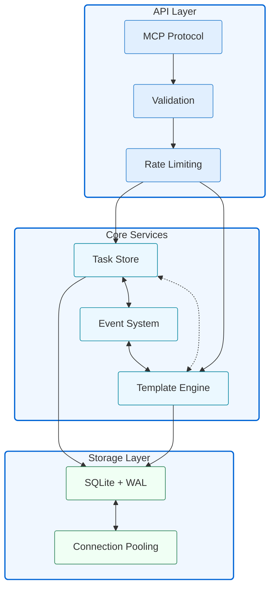

# ATLAS MCP Server

[](https://www.typescriptlang.org/)
[](https://modelcontextprotocol.io/)
[]()
[](https://opensource.org/licenses/Apache-2.0)
[]()
[](https://github.com/cyanheads/atlas-mcp-server)

ATLAS (Adaptive Task & Logic Automation System) is a high-performance Model Context Protocol server
designed for LLMs to manage complex task hierarchies. Built with TypeScript and featuring
ACID-compliant storage, efficient task tracking, and intelligent template management, ATLAS provides
LLM Agents task management through a clean, flexible tool interface.

## Table of Contents

- [Overview](#overview)
  - [Architecture & Components](#architecture--components)
- [Features](#features)
  - [Task Management](#task-management)
  - [Performance & Reliability](#performance--reliability)
  - [Validation & Safety](#validation--safety)
  - [Task Tracking](#task-tracking)
- [Installation](#installation)
- [Configuration](#configuration)
- [Templates](#templates)
  - [Core Features](#core-features)
  - [Built-in Templates](#built-in-templates)
- [Task Structure](#task-structure)
- [Tools](#tools)
  - [Task Operations](#task-operations)
  - [Maintenance Tools](#maintenance-tools)
- [Resources](#resources)
- [Best Practices](#best-practices)
  - [Task Organization](#task-organization)
  - [Performance Optimization](#performance-optimization)
  - [Error Prevention](#error-prevention)
- [Contributing](#contributing)
- [License](#license)

## Overview

ATLAS implements the Model Context Protocol (MCP), enabling standardized communication between LLMs
and external systems through:

- **Clients**: Claude Desktop, IDEs, and other MCP-compatible clients
- **Servers**: Tools and resources for task management and automation
- **LLM Agents**: AI models that leverage the server's task management capabilities

Key capabilities:

- **Hierarchical Task Organization**: Intuitive path-based structure with automatic relationship
  management
- **Task State Management**: Status monitoring and progress tracking
- **Smart Templates**: Pre-built and customizable templates for common workflows
- **Enterprise Features**: ACID compliance, connection pooling, automatic maintenance
- **Performance Focus**: Optimized caching, batch operations, and health monitoring

### Architecture & Components

Core system architecture:



Core Components:

- **Storage Layer**: ACID-compliant SQLite with WAL and connection pooling
- **Task Layer**: Validation, relationships, and dependency management
- **Event System**: Health monitoring and circuit breakers
- **Template Engine**: Inheritance and variable interpolation

## Features

### Task Management

- **Hierarchical Organization**: Path-based structure with automatic validation
- **Rich Metadata**: Flexible schema for requirements, progress, and documentation
- **Status Tracking**: State management with transition rules and dependency checks
- **Smart Templates**: Pre-built patterns with variable interpolation

### Performance & Reliability

- **Enterprise Storage**: SQLite with WAL and ACID compliance
- **Optimized Operations**: Batch processing and automatic maintenance
- **Health Monitoring**: System metrics and automatic recovery
- **Resource Management**: Memory monitoring and connection pooling

### Validation & Safety

- **Path Validation**: Automatic sanitization and format verification
- **Dependency Checks**: Cycle detection and relationship integrity
- **Schema Enforcement**: Type validation and constraint checking
- **Status Rules**: Transition validation and state consistency

### Task Tracking

- **Status Monitoring**: Efficient task state tracking
- **Progress Metrics**: Completion rates and status distribution
- **Dependency Tracking**: Relationship and blocking status monitoring
- **Performance Insights**: Resource tracking and bottleneck detection

## Installation

1. Clone the repository:

```bash
git clone https://github.com/cyanheads/atlas-mcp-server.git
cd atlas-mcp-server
```

2. Install dependencies:

```bash
npm install
```

3. Build the project:

```bash
npm run build
```

## Configuration

Add to your MCP client settings:

```json
{
  "mcpServers": {
    "atlas": {
      "command": "node",
      "args": ["/path/to/atlas-mcp-server/build/index.js"],
      "env": {
        // Storage Configuration
        "ATLAS_STORAGE_DIR": "/path/to/storage/directory", // Optional, defaults to ~/Documents/Cline/mcp-workspace/ATLAS
        "ATLAS_STORAGE_NAME": "atlas-tasks", // Optional, defaults to atlas-tasks
        "ATLAS_WAL_MODE": "true", // Optional, enables Write-Ahead Logging, defaults to true
        "ATLAS_POOL_SIZE": "5", // Optional, connection pool size, defaults to CPU cores

        // Performance Configuration
        "ATLAS_MAX_MEMORY": "1024", // Optional, in MB, defaults to 25% of system memory
        "ATLAS_CACHE_SIZE": "256", // Optional, in MB, defaults to 25% of max memory
        "ATLAS_BATCH_SIZE": "1000", // Optional, max items per batch, defaults to 1000
        "ATLAS_CHECKPOINT_INTERVAL": "30000", // Optional, in ms, defaults to 30000
        "ATLAS_VACUUM_INTERVAL": "3600000", // Optional, in ms, defaults to 1 hour

        // Monitoring Configuration
        "ATLAS_LOG_LEVEL": "info", // Optional, defaults to debug
        "ATLAS_METRICS_INTERVAL": "60000", // Optional, in ms, defaults to 60000
        "ATLAS_HEALTH_CHECK_INTERVAL": "30000", // Optional, in ms, defaults to 30000

        // Environment Configuration
        "NODE_ENV": "production", // Optional, defaults to development
        "ATLAS_TEMPLATE_DIRS": "/path/to/templates", // Optional, additional template directories
        "ATLAS_MAX_PATH_DEPTH": "10" // Optional, max task path depth, defaults to 10
      }
    }
  }
}
```

## Templates

ATLAS provides an intelligent template system that streamlines task creation and management:

### Core Features

- **Smart Variables**: Type-safe interpolation with validation
- **Inheritance**: Template composition with metadata transformation
- **Dynamic Generation**: Conditional tasks and automated dependencies
- **Validation**: Custom rules and relationship verification

### Built-in Templates

ATLAS includes two types of specialized templates:

1. Software Engineering Team Templates:

   - **Team Coordination**: Project setup, roles, and communication channels
   - **Product Design**: User research, requirements, and design systems
   - **System Architecture**: Technical design and system planning
   - **Security Engineering**: Security architecture and compliance
   - **DevOps**: Infrastructure automation and CI/CD
   - **Technical Leadership**: Development standards and quality assurance

2. Project Setup Templates:
   - **Web Project**: Modern web development setup with configurable features:
     - TypeScript support
     - Testing infrastructure
     - CI/CD workflows
     - CSS framework selection

Example team template usage:

```typescript
{
  "templateId": "software_engineer/team",
  "variables": {
    "projectName": "atlas-web",
    "teamScale": "growth",
    "developmentMethodology": "agile",
    "securityLevel": "standard",
    "complianceFrameworks": ["OWASP"],
    "enableMetrics": true
  }
}
```

Example web project template usage:

```typescript
{
  "templateId": "web-project",
  "variables": {
    "projectName": "my-web-app",
    "useTypeScript": true,
    "includeTesting": true,
    "includeCI": true,
    "cssFramework": "tailwind"
  }
}
```

See [templates/README.md](templates/README.md) for the complete template catalog.

## Task Structure

Tasks are organized using a hierarchical path-based format:

```typescript
{
  "path": "project/feature/task",
  "name": "Authentication Service",
  "type": "TASK",                    // or MILESTONE
  "status": "IN_PROGRESS",
  "dependencies": ["project/feature/design"],
  "metadata": {
    "priority": "high",
    "tags": ["security"],
    "technical": {
      "language": "typescript",
      "performance": { "latency": "<100ms" }
    }
  },
  "notes": {
    "planning": ["Security review"],
    "progress": ["JWT implemented"]
  }
}
```

Features:

- Path-based hierarchy (max depth: 10)
- Rich metadata and documentation
- Automated validation
- Progress tracking

## Tools

ATLAS provides a comprehensive set of tools for task management:

### Task Operations

```typescript
// Task Management
create_task; // Create new tasks
update_task; // Update existing tasks
get_tasks_by_status; // Find tasks by status
get_tasks_by_path; // Find tasks by path pattern
get_children; // List child tasks
delete_task; // Remove tasks

// Bulk Operations
bulk_task_operations; // Execute multiple task operations

// Template Operations
list_templates; // List available templates
use_template; // Instantiate a template
get_template_info; // Get template details
```

### Maintenance Tools

```typescript
// Database Maintenance
vacuum_database; // Optimize storage
repair_relationships; // Fix task relationships
clear_all_tasks; // Reset task database
```

## Resources

ATLAS exposes system resources through standard MCP endpoints:

### Task Overview (tasklist://current)

```typescript
{
  "totalTasks": 42,
  "statusCounts": {
    "IN_PROGRESS": 15,
    "COMPLETED": 12
  },
  "metrics": {
    "completionRate": "35%",
    "blockageRate": "7%"
  }
}
```

### Templates (templates://current)

```typescript
{
  "totalTemplates": 7,
  "templates": [{
    "id": "software_engineer/team",
    "name": "LLM Software Engineering Team",
    "description": "Coordinated team of LLM agents performing specialized software engineering roles",
    "variables": {
      "projectName": { "required": true },
      "teamScale": { "default": "growth" },
      "developmentMethodology": { "default": "agile" },
      "securityLevel": { "default": "standard" }
    }
  }, {
    "id": "web-project",
    "name": "Web Project Setup",
    "description": "Modern web development project setup with configurable features",
    "variables": {
      "projectName": { "required": true },
      "useTypeScript": { "default": true },
      "includeTesting": { "default": true },
      "cssFramework": { "default": "tailwind" }
    }
  }]
}
```

### Task Tracking (visualizations://current)

```typescript
{
  "timestamp": "2024-01-28T12:00:00Z",
  "summary": {
    "total": 42,
    "inProgress": 15,
    "completed": 12
  },
  "format": {
    "statusIndicators": {
      "COMPLETED": "✅",
      "IN_PROGRESS": "🔄"
    }
  }
}
```

## Best Practices

### Task Organization

- Use descriptive paths: `project/component/feature`
- Limit hierarchy depth (max 10 levels)
- Group related tasks under milestones
- Maintain clear dependencies
- Document changes in metadata

### Performance Optimization

- Use bulk operations for batch updates
- Enable WAL mode for concurrent access
- Configure appropriate cache sizes
- Schedule regular maintenance
- Monitor system health metrics

### Error Prevention

- Validate inputs before operations
- Use atomic transactions for consistency
- Implement retry logic with backoff
- Monitor error patterns
- Maintain audit trails

## Contributing

1. Fork the repository
2. Create a feature branch
3. Commit your changes
4. Push to the branch
5. Create a Pull Request

For bugs and feature requests, please create an issue.

## License

Apache License 2.0

---

<div align="center">
Built with the Model Context Protocol
</div>
