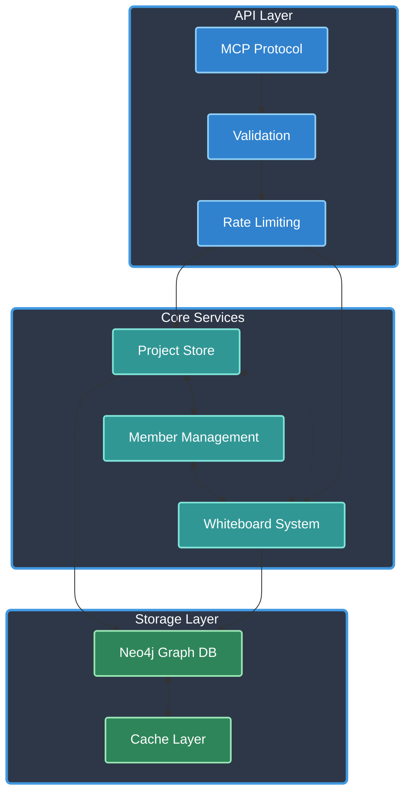

# ATLAS MCP Server 2.0

[](https://www.typescriptlang.org/)
[](https://modelcontextprotocol.io/)
[]()
[](https://opensource.org/licenses/Apache-2.0)
[]()
[](https://github.com/cyanheads/atlas-mcp-server)

ATLAS (Adaptive Task & Logic Automation System) is a Model Context Protocol server designed for LLMs to manage complex projects. Built with TypeScript and featuring
Neo4j graph database integration, efficient project management, and collaborative features, ATLAS provides LLM Agents project management capabilities through a clean, flexible tool interface.

> **Important Version Note**: [Version 1.5.4](https://github.com/cyanheads/atlas-mcp-server/releases/tag/v1.5.4) is the last version that uses SQLite as the database. Version 2.0 and onwards has been completely rewritten to use Neo4j, which requires either:
> - Self-hosting using Docker (docker-compose included in repository)
> - Using Neo4j AuraDB cloud service: https://neo4j.com/product/auradb/

## Table of Contents

- [Overview](#overview)
  - [Architecture & Components](#architecture--components)
- [Features](#features)
  - [Project Management](#project-management)
  - [Collaboration Features](#collaboration-features)
  - [Whiteboard System](#whiteboard-system)
  - [Graph Database Integration](#graph-database-integration)
- [Installation](#installation)
- [Configuration](#configuration)
- [Project Structure](#project-structure)
- [Tools](#tools)
  - [Project Operations](#project-operations)
  - [Member Management](#member-management)
  - [Dependency Management](#dependency-management)
  - [Whiteboard Operations](#whiteboard-operations)
  - [Database Operations](#database-operations)
- [Resources](#resources)
  - [Project Resources](#project-resources)
- [Best Practices](#best-practices)
  - [Project Organization](#project-organization)
  - [Performance Optimization](#performance-optimization)
  - [Error Prevention](#error-prevention)
- [Contributing](#contributing)
- [License](#license)

## Overview

ATLAS implements the Model Context Protocol (MCP), enabling standardized communication between LLMs and external systems through:

- **Clients**: Claude Desktop, IDEs, and other MCP-compatible clients
- **Servers**: Tools and resources for project management and collaboration
- **LLM Agents**: AI models that leverage the server's project management capabilities

Key capabilities:

- **Project Management**: Comprehensive project lifecycle management with metadata and status tracking
- **Collaboration Tools**: Member management, dependencies, and resource linking
- **Whiteboard System**: Real-time collaborative whiteboards with version history
- **Graph Database**: Neo4j-powered relationship management and querying
- **Performance Focus**: Optimized caching, batch operations, and health monitoring
- **Graceful Shutdown**: Robust error handling and graceful shutdown mechanisms

### Architecture & Components

Core system architecture:



Core Components:

- **Storage Layer**: Neo4j graph database with caching layer
- **Project Layer**: Project management, relationships, and dependency tracking
- **Member System**: Role-based access control and collaboration
- **Whiteboard Engine**: Real-time collaboration and version control
- **Error Handling**: Comprehensive error handling and logging system

## Features

### Project Management

- **Project Organization**: Comprehensive project metadata and status tracking
- **Rich Content**: Notes, links, and documentation management
- **Status Tracking**: Project lifecycle state management
- **Dependency Management**: Project relationship tracking and validation
- **Bulk Operations**: Efficient batch processing for project operations
- **Search Capabilities**: Advanced Neo4j-powered search functionality

### Collaboration Features

- **Member Management**: Role-based access control (owner, admin, member, viewer)
- **Team Coordination**: Project-level collaboration tools
- **Resource Sharing**: Link management and organization
- **Activity Tracking**: Project updates and member contributions

### Whiteboard System

- **Real-time Collaboration**: Shared whiteboard spaces
- **Version Control**: History tracking and rollback capabilities
- **Schema Validation**: Structured content validation
- **Project Integration**: Whiteboard-project relationships

### Graph Database Integration

- **Relationship Management**: Native graph database capabilities
- **Efficient Queries**: Optimized graph traversal and search
- **Data Integrity**: ACID-compliant transactions
- **Scalability**: High-performance graph operations
- **Advanced Search**: Property-based search with fuzzy matching and wildcards

## Installation

### Option 1: Install via npm

```bash
npm install atlas-mcp-server
```

### Option 2: Install from source

1. Clone the repository:
```bash
git clone https://github.com/cyanheads/atlas-mcp-server.git
cd atlas-mcp-server
```

2. Install dependencies:
```bash
npm install
```

3. Configure Neo4j:
```bash
# Start Neo4j using Docker
docker-compose up -d
```

4. Build the project:
```bash
npm run build
```

## Configuration

### Environment Variables

Create a `.env` file based on `.env.example`:

```bash
# Neo4j Configuration
NEO4J_URI=bolt://localhost:7687
NEO4J_USER=neo4j
NEO4J_PASSWORD=password2

# Application Configuration
LOG_LEVEL=info # debug, info, warn, error
NODE_ENV=development # development, production
```

### MCP Client Settings

Add to your MCP client settings:

```json
{
  "mcpServers": {
    "atlas": {
      "command": "node",
      "args": ["/path/to/atlas-mcp-server/dist/index.js"],
      "env": {
        "NEO4J_URI": "bolt://localhost:7687",
        "NEO4J_USER": "neo4j",
        "NEO4J_PASSWORD": "password2",
        "LOG_LEVEL": "info",
        "NODE_ENV": "production"
      }
    }
  }
}
```

## Project Structure

The codebase follows a modular structure:

```
src/
├── config/          # Configuration management
├── mcp/            # MCP server implementation
│   ├── resources/  # MCP resources
│   └── tools/      # MCP tools
├── scripts/        # Build and maintenance scripts
├── logs/           # Application logs
├── output/         # Generated output files
├── neo4j/         # Neo4j database services
│   └── projectService/ # Project-related operations
├── types/         # TypeScript type definitions
└── utils/         # Utility functions
```

## Tools

ATLAS 2.0 provides comprehensive tools for project management:

### Project Operations

```typescript
// Project Management
project_create    // Create new projects
project_update    // Update existing projects
project_delete    // Remove projects
project_note_add  // Add project notes
project_link_add  // Add project links

// Bulk Operations
project_create (bulk mode)  // Create multiple projects
project_update (bulk mode)  // Update multiple projects
```

### Member Management

```typescript
// Member Operations
project_member_add     // Add project members
project_member_remove  // Remove project members
project_member_list    // List project members
```

### Dependency Management

```typescript
// Dependency Operations
project_dependency_add     // Add project dependencies
project_dependency_remove  // Remove project dependencies
project_dependency_list    // List project dependencies
```

### Whiteboard Operations

```typescript
// Whiteboard Management
whiteboard_create   // Create new whiteboards
whiteboard_update   // Update whiteboard content
whiteboard_get      // Retrieve whiteboard data
whiteboard_delete   // Remove whiteboards
```

### Database Operations

```typescript
// Neo4j Search
neo4j_search       // Search nodes with property filters
database_clean     // Clean and reinitialize database
```

## Resources

ATLAS 2.0 exposes system resources through standard MCP endpoints:

### Project Resources

```typescript
// Project List 
atlas-project://list-all     // Lists all projects with pagination support. 
                             // Features: 
                             // - Projects are ordered by creation date (newest first)
                             // - Paginate results with customizable page size
                             // Returns an array of projects along with total count, current page info, and applied filters.

// Project Details
atlas-project://{projectId}  // Fetches detailed information about a specific project.
                             // Supports including related data like notes, links, dependencies, and members.

// Project Notes
atlas-project://{projectId}/notes  // Fetches notes associated with a specific project.
                                   // Supports filtering by tags, time range, and sorting options.
                                   // Returns both note data and metadata about tags and timestamps.

// Project Links
atlas-project://{projectId}/links  // Fetches links associated with a specific project.
                                   // Supports filtering by category, search terms, and sorting options.
                                   // Returns both link data and metadata about categories and domains.

// Project Dependencies
atlas-project://{projectId}/dependencies  // Lists all dependencies and dependents for a project.
                                         // Dependencies are projects that this project depends on, while dependents are projects that depend on this project.
                                         // Results are grouped by relationship type.

// Project Members
atlas-project://{projectId}/members  // Lists all members of a project along with their roles and join dates.
                                    // Results are ordered by join date, with project owners listed first.
                                    // Supports filtering by role and user ID.
```

## Contributing

1. Fork the repository
2. Create a feature branch
3. Commit your changes
4. Push to the branch
5. Create a Pull Request

For bugs and feature requests, please create an issue.

## License

Apache License 2.0

---

<div align="center">
Built with the Model Context Protocol
</div>